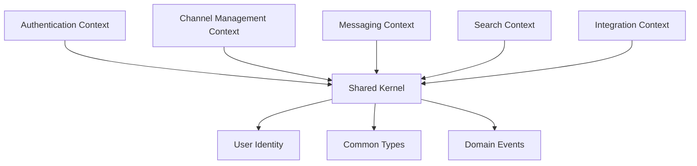

# DevChat - Architecture Guide

## 📋 Table of Contents

1. [System Overview](#system-overview)
2. [Architecture Patterns](#architecture-patterns)
3. [Domain Design](#domain-design)
4. [Data Flow](#data-flow)
5. [Security Architecture](#security-architecture)
6. [Scalability Design](#scalability-design)
7. [Integration Patterns](#integration-patterns)
8. [Performance Considerations](#performance-considerations)
9. [Monitoring & Observability](#monitoring--observability)
10. [Future Architecture](#future-architecture)

---

## 🏗️ System Overview

### High-Level Architecture

```
┌─────────────────────────────────────────────────────────────────┐
│                        Client Layer                             │
├─────────────────────┬─────────────────────┬─────────────────────┤
│   Web Frontend      │   Mobile Apps       │   Third-party       │
│   (React/Vue)       │   (React Native)    │   Integrations      │
└─────────────────────┴─────────────────────┴─────────────────────┘
                              │
                              ▼
┌─────────────────────────────────────────────────────────────────┐
│                    API Gateway / Load Balancer                 │
│                         (Nginx)                                │
└─────────────────────────────────────────────────────────────────┘
                              │
                              ▼
┌─────────────────────────────────────────────────────────────────┐
│                    Application Layer                           │
│                       (NestJS)                                 │
├─────────────────────┬─────────────────────┬─────────────────────┤
│   REST API          │   GraphQL API       │   WebSocket         │
│   Controllers       │   Resolvers         │   Gateways          │
└─────────────────────┴─────────────────────┴─────────────────────┘
                              │
                              ▼
┌─────────────────────────────────────────────────────────────────┐
│                    Business Logic Layer                        │
├─────────────────────┬─────────────────────┬─────────────────────┤
│   Auth Module       │   User Module       │   Channel Module    │
│   - Authentication  │   - User Management │   - Channel Mgmt    │
│   - Authorization   │   - Profile Mgmt    │   - Permissions     │
│   - 2FA             │   - Preferences     │   - Moderation      │
└─────────────────────┼─────────────────────┼─────────────────────┤
│   Message Module    │   Search Module     │   Integration       │
│   - Message CRUD    │   - Full-text Search│   - GitHub Webhooks │
│   - File Uploads    │   - Advanced Query  │   - Slack Bridge    │
│   - Reactions       │   - Elasticsearch   │   - Email Notif     │
└─────────────────────┴─────────────────────┴─────────────────────┘
                              │
                              ▼
┌─────────────────────────────────────────────────────────────────┐
│                      Data Access Layer                         │
├─────────────────────┬─────────────────────┬─────────────────────┤
│   Repository        │   Cache Layer       │   Event Store       │
│   Pattern           │   (Redis)           │   (Event Sourcing)  │
│   (TypeORM)         │   - Session Store   │   - Audit Trail     │
└─────────────────────┴─────────────────────┴─────────────────────┘
                              │
                              ▼
┌─────────────────────────────────────────────────────────────────┐
│                      Data Storage Layer                        │
├─────────────────────┬─────────────────────┬─────────────────────┤
│   PostgreSQL        │   MongoDB           │   File Storage      │
│   - User Data       │   - Messages        │   - Uploads         │
│   - Channel Data    │   - Chat History    │   - Avatars         │
│   - Metadata        │   - Search Index    │   - Attachments     │
└─────────────────────┴─────────────────────┴─────────────────────┘
```

### Technology Stack

| Layer            | Technology                                  | Purpose                         |
| ---------------- | ------------------------------------------- | ------------------------------- |
| **Frontend**     | React/Vue.js, TypeScript                    | User interface                  |
| **Mobile**       | React Native, Expo                          | Mobile applications             |
| **API Gateway**  | Nginx, HAProxy                              | Load balancing, SSL termination |
| **Backend**      | NestJS, Node.js 22, TypeScript              | Application server              |
| **Real-time**    | Socket.IO, WebSockets                       | Real-time communication         |
| **Database**     | PostgreSQL 16                               | Primary data storage            |
| **Document DB**  | MongoDB 7                                   | Message storage, search         |
| **Cache**        | Redis 7                                     | Session, rate limiting, pub/sub |
| **Search**       | Elasticsearch                               | Advanced search capabilities    |
| **File Storage** | AWS S3, Minio                               | File uploads and assets         |
| **Monitoring**   | Prometheus, Grafana, Sentry                 | Metrics and error tracking      |
| **Logging**      | ELK Stack (Elasticsearch, Logstash, Kibana) | Centralized logging             |

---

## 🎯 Architecture Patterns

### 1. Domain-Driven Design (DDD)

```
src/
├── modules/
│   ├── auth/                    # Authentication Domain
│   │   ├── domain/
│   │   │   ├── entities/        # Domain entities
│   │   │   ├── value-objects/   # Value objects
│   │   │   ├── repositories/    # Repository interfaces
│   │   │   └── services/        # Domain services
│   │   ├── infrastructure/
│   │   │   ├── repositories/    # Repository implementations
│   │   │   ├── external/        # External service adapters
│   │   │   └── persistence/     # Database configurations
│   │   ├── application/
│   │   │   ├── commands/        # Command handlers (CQRS)
│   │   │   ├── queries/         # Query handlers (CQRS)
│   │   │   ├── dto/             # Data transfer objects
│   │   │   └── services/        # Application services
│   │   └── presentation/
│   │       ├── controllers/     # REST controllers
│   │       ├── resolvers/       # GraphQL resolvers
│   │       └── gateways/        # WebSocket gateways
```

### 2. CQRS (Command Query Responsibility Segregation)

```typescript
// Command side - Write operations
@CommandHandler(CreateUserCommand)
export class CreateUserHandler implements ICommandHandler<CreateUserCommand> {
  constructor(
    private userRepository: UserRepository,
    private eventBus: EventBus,
  ) {}

  async execute(command: CreateUserCommand): Promise<void> {
    const user = User.create(command.userData);
    await this.userRepository.save(user);

    // Publish domain event
    this.eventBus.publish(new UserCreatedEvent(user.id, user.email));
  }
}

// Query side - Read operations
@QueryHandler(GetUserQuery)
export class GetUserHandler implements IQueryHandler<GetUserQuery> {
  constructor(private userReadModel: UserReadModelRepository) {}

  async execute(query: GetUserQuery): Promise<UserDto> {
    return this.userReadModel.findById(query.userId);
  }
}
```

### 3. Event-Driven Architecture

```typescript
// Domain Events
export class UserCreatedEvent implements IEvent {
  constructor(
    public readonly userId: string,
    public readonly email: string,
    public readonly occurredOn: Date = new Date(),
  ) {}
}

// Event Handlers
@EventsHandler(UserCreatedEvent)
export class UserCreatedHandler implements IEventHandler<UserCreatedEvent> {
  constructor(
    private emailService: EmailService,
    private analyticsService: AnalyticsService,
  ) {}

  async handle(event: UserCreatedEvent): Promise<void> {
    // Send welcome email
    await this.emailService.sendWelcomeEmail(event.email);

    // Track user registration
    await this.analyticsService.track('user_registered', {
      userId: event.userId,
      timestamp: event.occurredOn,
    });
  }
}
```

### 4. Microservices Preparation

```typescript
// Service interfaces for future extraction
export interface IUserService {
  createUser(userData: CreateUserDto): Promise<User>;
  findUserById(id: string): Promise<User>;
  updateUser(id: string, updateData: UpdateUserDto): Promise<User>;
  deleteUser(id: string): Promise<void>;
}

export interface IMessageService {
  sendMessage(messageData: SendMessageDto): Promise<Message>;
  getChannelMessages(channelId: string, pagination: PaginationDto): Promise<Message[]>;
  updateMessage(messageId: string, content: string): Promise<Message>;
  deleteMessage(messageId: string): Promise<void>;
}

// Implementation can be easily extracted to separate services
@Injectable()
export class UserService implements IUserService {
  // Implementation
}
```

---

## 🏛️ Domain Design

### Core Domains

#### 1. Authentication & Authorization Domain

```typescript
// Domain Entity
export class User extends AggregateRoot {
  private constructor(
    private readonly id: UserId,
    private username: Username,
    private email: Email,
    private password: HashedPassword,
    private role: UserRole,
    private profile: UserProfile,
    private security: SecuritySettings,
  ) {
    super();
  }

  static create(userData: CreateUserData): User {
    const user = new User(
      UserId.generate(),
      new Username(userData.username),
      new Email(userData.email),
      HashedPassword.fromPlainText(userData.password),
      UserRole.USER,
      UserProfile.create(userData.profile),
      SecuritySettings.default(),
    );

    user.apply(new UserCreatedEvent(user.id.value, user.email.value));
    return user;
  }

  enableTwoFactor(secret: string): void {
    this.security.enableTwoFactor(secret);
    this.apply(new TwoFactorEnabledEvent(this.id.value));
  }

  changePassword(currentPassword: string, newPassword: string): void {
    if (!this.password.matches(currentPassword)) {
      throw new InvalidPasswordError();
    }

    this.password = HashedPassword.fromPlainText(newPassword);
    this.apply(new PasswordChangedEvent(this.id.value));
  }
}

// Value Objects
export class Email {
  constructor(private readonly value: string) {
    if (!this.isValid(value)) {
      throw new InvalidEmailError(value);
    }
  }

  private isValid(email: string): boolean {
    return /^[^\s@]+@[^\s@]+\.[^\s@]+$/.test(email);
  }

  getValue(): string {
    return this.value;
  }
}

export class Username {
  constructor(private readonly value: string) {
    if (!this.isValid(value)) {
      throw new InvalidUsernameError(value);
    }
  }

  private isValid(username: string): boolean {
    return /^[a-zA-Z0-9_]{3,30}$/.test(username);
  }

  getValue(): string {
    return this.value;
  }
}
```

#### 2. Channel Management Domain

```typescript
export class Channel extends AggregateRoot {
  private constructor(
    private readonly id: ChannelId,
    private name: ChannelName,
    private description: string,
    private type: ChannelType,
    private owner: UserId,
    private members: ChannelMembers,
    private permissions: ChannelPermissions,
    private settings: ChannelSettings,
  ) {
    super();
  }

  static create(channelData: CreateChannelData, ownerId: UserId): Channel {
    const channel = new Channel(
      ChannelId.generate(),
      new ChannelName(channelData.name),
      channelData.description,
      channelData.type,
      ownerId,
      ChannelMembers.withOwner(ownerId),
      ChannelPermissions.default(channelData.type),
      ChannelSettings.default(),
    );

    channel.apply(new ChannelCreatedEvent(channel.id.value, ownerId.value));
    return channel;
  }

  addMember(userId: UserId, addedBy: UserId): void {
    if (!this.canAddMembers(addedBy)) {
      throw new InsufficientPermissionsError();
    }

    this.members.add(userId);
    this.apply(new MemberAddedEvent(this.id.value, userId.value, addedBy.value));
  }

  removeMember(userId: UserId, removedBy: UserId): void {
    if (!this.canRemoveMembers(removedBy) || userId.equals(this.owner)) {
      throw new InsufficientPermissionsError();
    }

    this.members.remove(userId);
    this.apply(new MemberRemovedEvent(this.id.value, userId.value, removedBy.value));
  }

  private canAddMembers(userId: UserId): boolean {
    return (
      this.owner.equals(userId) || this.permissions.hasPermission(userId, Permission.ADD_MEMBERS)
    );
  }
}
```

#### 3. Messaging Domain

```typescript
export class Message extends AggregateRoot {
  private constructor(
    private readonly id: MessageId,
    private content: MessageContent,
    private readonly channelId: ChannelId,
    private readonly authorId: UserId,
    private readonly type: MessageType,
    private attachments: Attachment[],
    private reactions: MessageReactions,
    private metadata: MessageMetadata,
  ) {
    super();
  }

  static create(messageData: CreateMessageData): Message {
    const message = new Message(
      MessageId.generate(),
      new MessageContent(messageData.content),
      new ChannelId(messageData.channelId),
      new UserId(messageData.authorId),
      messageData.type || MessageType.TEXT,
      messageData.attachments || [],
      MessageReactions.empty(),
      MessageMetadata.create(),
    );

    message.apply(
      new MessageCreatedEvent(message.id.value, message.channelId.value, message.authorId.value),
    );

    return message;
  }

  edit(newContent: string, editedBy: UserId): void {
    if (!this.canEdit(editedBy)) {
      throw new MessageEditNotAllowedError();
    }

    this.content = new MessageContent(newContent);
    this.metadata.markAsEdited();

    this.apply(new MessageEditedEvent(this.id.value, newContent));
  }

  addReaction(emoji: string, userId: UserId): void {
    this.reactions.add(emoji, userId);
    this.apply(new ReactionAddedEvent(this.id.value, emoji, userId.value));
  }

  private canEdit(userId: UserId): boolean {
    return this.authorId.equals(userId) && this.metadata.isWithinEditWindow();
  }
}
```

### Bounded Contexts



---

## 🌊 Data Flow

### 1. Request Flow Architecture

```
Client Request → API Gateway → Load Balancer → Application Instance
                                                        ↓
                                              Route to Controller
                                                        ↓
                                              Validate Input (DTOs)
                                                        ↓
                                              Execute Business Logic
                                                        ↓
                                              Repository Layer
                                                        ↓
                                              Database/Cache
```

### 2. Real-time Communication Flow

```typescript
// WebSocket Gateway
@WebSocketGateway({
  cors: { origin: '*' },
  namespace: '/chat',
})
export class ChatGateway implements OnGatewayConnection, OnGatewayDisconnect {
  constructor(
    private messageService: MessageService,
    private channelService: ChannelService,
    private authService: AuthService,
  ) {}

  async handleConnection(client: Socket) {
    try {
      const user = await this.authService.validateSocketConnection(client);
      client.data.user = user;

      // Join user to their channels
      const userChannels = await this.channelService.getUserChannels(user.id);
      userChannels.forEach((channel) => {
        client.join(`channel:${channel.id}`);
      });

      client.emit('connected', { userId: user.id });
    } catch (error) {
      client.disconnect();
    }
  }

  @SubscribeMessage('send_message')
  async handleMessage(@ConnectedSocket() client: Socket, @MessageBody() payload: SendMessageDto) {
    const user = client.data.user;

    // Validate permission to send message
    const canSend = await this.channelService.canUserSendMessage(user.id, payload.channelId);

    if (!canSend) {
      client.emit('error', { message: 'Permission denied' });
      return;
    }

    // Create and save message
    const message = await this.messageService.createMessage({
      ...payload,
      authorId: user.id,
    });

    // Broadcast to channel members
    this.server.to(`channel:${payload.channelId}`).emit('new_message', message);

    // Send notifications to offline users
    await this.notificationService.notifyChannelMembers(payload.channelId, message);
  }
}
```

### 3. Event Flow

```typescript
// Event Bus Implementation
@Injectable()
export class EventBus {
  private handlers = new Map<string, Function[]>();

  subscribe<T extends IEvent>(
    eventType: new (...args: any[]) => T,
    handler: (event: T) => Promise<void>,
  ): void {
    const eventName = eventType.name;
    const existingHandlers = this.handlers.get(eventName) || [];
    this.handlers.set(eventName, [...existingHandlers, handler]);
  }

  async publish<T extends IEvent>(event: T): Promise<void> {
    const eventName = event.constructor.name;
    const handlers = this.handlers.get(eventName) || [];

    // Execute handlers in parallel
    await Promise.all(handlers.map((handler) => this.executeHandler(handler, event)));
  }

  private async executeHandler(handler: Function, event: IEvent): Promise<void> {
    try {
      await handler(event);
    } catch (error) {
      // Log error but don't fail the entire event publishing
      console.error(`Event handler failed for ${event.constructor.name}:`, error);
    }
  }
}
```

### 4. Data Synchronization

```typescript
// Read Model Updater
@Injectable()
export class ReadModelUpdater {
  constructor(
    private userReadModelRepo: UserReadModelRepository,
    private channelReadModelRepo: ChannelReadModelRepository,
  ) {}

  @EventsHandler(UserCreatedEvent)
  async handleUserCreated(event: UserCreatedEvent): Promise<void> {
    const readModel = {
      id: event.userId,
      email: event.email,
      createdAt: event.occurredOn,
      lastSeen: event.occurredOn,
      isOnline: false,
    };

    await this.userReadModelRepo.save(readModel);
  }

  @EventsHandler(MessageCreatedEvent)
  async handleMessageCreated(event: MessageCreatedEvent): Promise<void> {
    // Update channel last message
    await this.channelReadModelRepo.updateLastMessage(
      event.channelId,
      event.messageId,
      event.occurredOn,
    );

    // Update user activity
    await this.userReadModelRepo.updateLastSeen(event.authorId, event.occurredOn);
  }
}
```

---

## 🔒 Security Architecture

### 1. Authentication Architecture

```typescript
// Multi-layer Authentication
@Injectable()
export class AuthenticationService {
  constructor(
    private userService: UserService,
    private jwtService: JwtService,
    private twoFactorService: TwoFactorService,
    private sessionService: SessionService,
  ) {}

  async authenticateUser(credentials: LoginCredentials): Promise<AuthResult> {
    // 1. Validate credentials
    const user = await this.validateCredentials(credentials);

    // 2. Check account status
    this.checkAccountStatus(user);

    // 3. Handle 2FA if enabled
    if (user.has2FAEnabled()) {
      return this.initiate2FAFlow(user, credentials.twoFactorToken);
    }

    // 4. Create session
    const session = await this.sessionService.createSession(user);

    // 5. Generate tokens
    const tokens = await this.generateTokens(user, session);

    // 6. Log authentication event
    await this.auditService.logAuthentication(user.id, 'success');

    return { user, tokens, session };
  }

  private async validateCredentials(credentials: LoginCredentials): Promise<User> {
    const user = await this.userService.findByEmail(credentials.email);

    if (!user || !(await user.verifyPassword(credentials.password))) {
      await this.auditService.logAuthentication(credentials.email, 'failed');
      throw new InvalidCredentialsException();
    }

    return user;
  }
}
```

### 2. Authorization Architecture

```typescript
// Role-Based Access Control (RBAC)
export enum Permission {
  READ_MESSAGES = 'read:messages',
  WRITE_MESSAGES = 'write:messages',
  DELETE_MESSAGES = 'delete:messages',
  MANAGE_CHANNELS = 'manage:channels',
  MANAGE_USERS = 'manage:users',
  ADMIN_ACCESS = 'admin:access',
}

export enum Role {
  USER = 'user',
  MODERATOR = 'moderator',
  ADMIN = 'admin',
}

@Injectable()
export class AuthorizationService {
  private rolePermissions = new Map<Role, Permission[]>([
    [Role.USER, [Permission.READ_MESSAGES, Permission.WRITE_MESSAGES]],
    [
      Role.MODERATOR,
      [
        Permission.READ_MESSAGES,
        Permission.WRITE_MESSAGES,
        Permission.DELETE_MESSAGES,
        Permission.MANAGE_CHANNELS,
      ],
    ],
    [Role.ADMIN, Object.values(Permission)],
  ]);

  hasPermission(user: User, permission: Permission): boolean {
    const userPermissions = this.rolePermissions.get(user.role) || [];
    return userPermissions.includes(permission);
  }

  canAccessChannel(user: User, channel: Channel): boolean {
    // Public channels - anyone can access
    if (channel.isPublic()) return true;

    // Private channels - only members
    if (channel.isPrivate()) return channel.hasMember(user.id);

    // Direct messages - only participants
    if (channel.isDirectMessage()) return channel.isParticipant(user.id);

    return false;
  }
}

// Permission Decorator
export function RequirePermission(permission: Permission) {
  return applyDecorators(
    SetMetadata('permission', permission),
    UseGuards(JwtAuthGuard, PermissionGuard),
  );
}
```

### 3. Data Protection

```typescript
// Data Encryption Service
@Injectable()
export class EncryptionService {
  private readonly algorithm = 'aes-256-gcm';
  private readonly keyDerivationRounds = 100000;

  async encryptSensitiveData(data: string, userKey?: string): Promise<EncryptedData> {
    const key = userKey || (await this.deriveKey());
    const iv = crypto.randomBytes(16);
    const cipher = crypto.createCipher(this.algorithm, key);
    cipher.setAAD(Buffer.from('devchat-encryption'));

    let encrypted = cipher.update(data, 'utf8', 'hex');
    encrypted += cipher.final('hex');

    const authTag = cipher.getAuthTag();

    return {
      encryptedData: encrypted,
      iv: iv.toString('hex'),
      authTag: authTag.toString('hex'),
    };
  }

  async decryptSensitiveData(encryptedData: EncryptedData, userKey?: string): Promise<string> {
    const key = userKey || (await this.deriveKey());
    const decipher = crypto.createDecipher(this.algorithm, key);

    decipher.setAuthTag(Buffer.from(encryptedData.authTag, 'hex'));
    decipher.setAAD(Buffer.from('devchat-encryption'));

    let decrypted = decipher.update(encryptedData.encryptedData, 'hex', 'utf8');
    decrypted += decipher.final('utf8');

    return decrypted;
  }
}
```

---

## 📈 Scalability Design

### 1. Horizontal Scaling Strategy

```typescript
// Load Balancer Configuration
export class LoadBalancerConfig {
  static getStrategy(): LoadBalanceStrategy {
    return {
      algorithm: 'round-robin', // or 'least-connections', 'ip-hash'
      healthCheck: {
        endpoint: '/health',
        interval: 30000,
        timeout: 5000,
        retries: 3,
      },
      stickySession: {
        enabled: true,
        cookieName: 'devchat-session',
        duration: 3600000, // 1 hour
      },
    };
  }
}

// WebSocket Clustering with Redis
@Injectable()
export class RedisWebSocketAdapter extends IoAdapter {
  private redisAdapter: any;

  constructor(private app: INestApplication) {
    super(app);
  }

  async connectToRedis(): Promise<void> {
    const pubClient = new Redis({
      host: process.env.REDIS_HOST,
      port: parseInt(process.env.REDIS_PORT),
      password: process.env.REDIS_PASSWORD,
    });

    const subClient = pubClient.duplicate();
    this.redisAdapter = createAdapter(pubClient, subClient);
  }

  createIOServer(port: number, options?: any): any {
    const server = super.createIOServer(port, options);
    server.adapter(this.redisAdapter);
    return server;
  }
}
```

### 2. Database Scaling

```typescript
// Database Connection Pool Configuration
export class DatabaseConfig {
  static getPostgreSQLConfig(): TypeOrmModuleOptions {
    return {
      type: 'postgres',
      host: process.env.POSTGRES_HOST,
      port: parseInt(process.env.POSTGRES_PORT),
      username: process.env.POSTGRES_USERNAME,
      password: process.env.POSTGRES_PASSWORD,
      database: process.env.POSTGRES_DATABASE,

      // Connection pooling
      extra: {
        max: 20, // Maximum pool size
        min: 5, // Minimum pool size
        acquire: 60000, // Maximum time to wait for connection
        idle: 10000, // Maximum idle time
        evict: 1000, // Eviction run interval

        // Read replicas for scaling reads
        replication: {
          master: {
            host: process.env.POSTGRES_MASTER_HOST,
            username: process.env.POSTGRES_MASTER_USER,
            password: process.env.POSTGRES_MASTER_PASSWORD,
          },
          slaves: [
            {
              host: process.env.POSTGRES_SLAVE_1_HOST,
              username: process.env.POSTGRES_SLAVE_USER,
              password: process.env.POSTGRES_SLAVE_PASSWORD,
            },
            {
              host: process.env.POSTGRES_SLAVE_2_HOST,
              username: process.env.POSTGRES_SLAVE_USER,
              password: process.env.POSTGRES_SLAVE_PASSWORD,
            },
          ],
        },
      },
    };
  }
}

// Read/Write Splitting
@Injectable()
export class UserRepository {
  constructor(
    @InjectRepository(User) private readonly writeRepo: Repository<User>,
    @InjectRepository(User, 'slave') private readonly readRepo: Repository<User>,
  ) {}

  // Write operations go to master
  async save(user: User): Promise<User> {
    return this.writeRepo.save(user);
  }

  // Read operations go to slaves
  async findById(id: string): Promise<User | null> {
    return this.readRepo.findOne({ where: { id } });
  }

  async findAll(options: FindOptions): Promise<User[]> {
    return this.readRepo.find(options);
  }
}
```

### 3. Caching Strategy

```typescript
// Multi-level Caching
@Injectable()
export class CachingService {
  constructor(
    @Inject('REDIS_CLIENT') private redis: Redis,
    private memoryCache: MemoryCache,
  ) {}

  async get<T>(key: string): Promise<T | null> {
    // L1: Memory cache (fastest)
    let data = this.memoryCache.get<T>(key);
    if (data) return data;

    // L2: Redis cache (fast)
    const redisData = await this.redis.get(key);
    if (redisData) {
      data = JSON.parse(redisData);
      this.memoryCache.set(key, data, 60); // Cache in memory for 1 minute
      return data;
    }

    return null;
  }

  async set(key: string, value: any, ttl: number = 3600): Promise<void> {
    const serialized = JSON.stringify(value);

    // Store in both caches
    await Promise.all([
      this.redis.setex(key, ttl, serialized),
      this.memoryCache.set(key, value, Math.min(ttl, 300)), // Max 5 minutes in memory
    ]);
  }

  async invalidate(pattern: string): Promise<void> {
    // Invalidate memory cache
    this.memoryCache.deleteByPattern(pattern);

    // Invalidate Redis cache
    const keys = await this.redis.keys(pattern);
    if (keys.length > 0) {
      await this.redis.del(...keys);
    }
  }
}

// Cache Decorator
export function Cacheable(ttl: number = 3600, key?: string) {
  return function (target: any, propertyName: string, descriptor: PropertyDescriptor) {
    const method = descriptor.value;

    descriptor.value = async function (...args: any[]) {
      const cacheKey = key || `${target.constructor.name}:${propertyName}:${JSON.stringify(args)}`;
      const cached = await this.cachingService.get(cacheKey);

      if (cached) return cached;

      const result = await method.apply(this, args);
      await this.cachingService.set(cacheKey, result, ttl);

      return result;
    };
  };
}
```

---

## 🔗 Integration Patterns

### 1. External Service Integration

```typescript
// GitHub Integration
@Injectable()
export class GitHubIntegrationService {
  constructor(
    private httpService: HttpService,
    private webhookService: WebhookService,
    private channelService: ChannelService,
  ) {}

  async handleWebhook(payload: GitHubWebhookPayload): Promise<void> {
    const strategy = this.getHandlingStrategy(payload.event);
    await strategy.handle(payload);
  }

  private getHandlingStrategy(event: string): WebhookHandler {
    const strategies = {
      push: new PushEventHandler(this.channelService),
      pull_request: new PullRequestHandler(this.channelService),
      issues: new IssueEventHandler(this.channelService),
    };

    return strategies[event] || new DefaultHandler();
  }
}

// Webhook Handler Pattern
interface WebhookHandler {
  handle(payload: any): Promise<void>;
}

class PushEventHandler implements WebhookHandler {
  constructor(private channelService: ChannelService) {}

  async handle(payload: GitHubPushPayload): Promise<void> {
    const message = this.formatPushMessage(payload);
    const channels = await this.findIntegratedChannels(payload.repository.id);

    await Promise.all(
      channels.map((channel) => this.channelService.sendSystemMessage(channel.id, message)),
    );
  }

  private formatPushMessage(payload: GitHubPushPayload): string {
    const commits = payload.commits.slice(0, 3); // Show max 3 commits
    const commitList = commits.map((c) => `• ${c.message} (${c.id.substring(0, 7)})`);

    return `🔔 **${payload.pusher.name}** pushed ${payload.commits.length} commit(s) to **${payload.repository.name}**\n\n${commitList.join('\n')}`;
  }
}
```

### 2. Email Integration

```typescript
// Email Service with Template Engine
@Injectable()
export class EmailService {
  constructor(
    private configService: ConfigService,
    private templateEngine: TemplateEngine,
  ) {}

  async sendWelcomeEmail(user: User): Promise<void> {
    const template = await this.templateEngine.render('welcome', {
      userName: user.username,
      loginUrl: `${this.configService.get('FRONTEND_URL')}/login`,
    });

    await this.sendEmail({
      to: user.email,
      subject: 'Welcome to DevChat!',
      html: template,
    });
  }

  async sendPasswordResetEmail(user: User, resetToken: string): Promise<void> {
    const resetUrl = `${this.configService.get('FRONTEND_URL')}/reset-password?token=${resetToken}`;

    const template = await this.templateEngine.render('password-reset', {
      userName: user.username,
      resetUrl,
      expiresIn: '1 hour',
    });

    await this.sendEmail({
      to: user.email,
      subject: 'Password Reset Request',
      html: template,
    });
  }

  private async sendEmail(options: EmailOptions): Promise<void> {
    // Implementation with your email provider (SendGrid, SES, etc.)
  }
}
```

### 3. Search Integration

```typescript
// Elasticsearch Integration
@Injectable()
export class SearchService {
  constructor(@Inject('ELASTICSEARCH_CLIENT') private client: Client) {}

  async indexMessage(message: Message): Promise<void> {
    await this.client.index({
      index: 'messages',
      id: message.id,
      body: {
        content: message.content,
        channelId: message.channelId,
        authorId: message.authorId,
        timestamp: message.createdAt,
        attachments: message.attachments.map((a) => ({
          filename: a.filename,
          type: a.mimeType,
        })),
      },
    });
  }

  async searchMessages(query: SearchQuery): Promise<SearchResult<Message>> {
    const searchBody = this.buildSearchQuery(query);

    const response = await this.client.search({
      index: 'messages',
      body: searchBody,
    });

    return this.mapSearchResponse(response);
  }

  private buildSearchQuery(query: SearchQuery): any {
    return {
      query: {
        bool: {
          must: [
            {
              multi_match: {
                query: query.text,
                fields: ['content^2', 'attachments.filename'],
                fuzziness: 'AUTO',
              },
            },
          ],
          filter: [
            ...(query.channelId ? [{ term: { channelId: query.channelId } }] : []),
            ...(query.dateFrom ? [{ range: { timestamp: { gte: query.dateFrom } } }] : []),
            ...(query.dateTo ? [{ range: { timestamp: { lte: query.dateTo } } }] : []),
          ],
        },
      },
      highlight: {
        fields: {
          content: {},
        },
      },
      sort: [{ timestamp: { order: 'desc' } }],
      from: query.offset || 0,
      size: query.limit || 20,
    };
  }
}
```

---

## ⚡ Performance Considerations

### 1. Database Optimization

```sql
-- Optimized indexes for common queries
CREATE INDEX CONCURRENTLY idx_messages_channel_timestamp
ON messages (channel_id, created_at DESC);

CREATE INDEX CONCURRENTLY idx_messages_author_timestamp
ON messages (author_id, created_at DESC);

CREATE INDEX CONCURRENTLY idx_users_email_hash
ON users USING hash (email);

CREATE INDEX CONCURRENTLY idx_channels_type_active
ON channels (type, is_active) WHERE is_active = true;

-- Partial indexes for better performance
CREATE INDEX CONCURRENTLY idx_messages_unread
ON messages (channel_id, created_at)
WHERE read_at IS NULL;

-- Composite indexes for complex queries
CREATE INDEX CONCURRENTLY idx_channel_members_user_channel
ON channel_members (user_id, channel_id, joined_at);
```

### 2. Query Optimization

```typescript
// Optimized Repository Methods
@Injectable()
export class MessageRepository {
  constructor(@InjectRepository(Message) private repo: Repository<Message>) {}

  // Efficient pagination with cursor-based approach
  async findChannelMessages(
    channelId: string,
    limit: number = 50,
    cursor?: string,
  ): Promise<Message[]> {
    const queryBuilder = this.repo
      .createQueryBuilder('message')
      .leftJoinAndSelect('message.author', 'author')
      .leftJoinAndSelect('message.attachments', 'attachments')
      .where('message.channelId = :channelId', { channelId })
      .orderBy('message.createdAt', 'DESC')
      .limit(limit);

    if (cursor) {
      queryBuilder.andWhere('message.createdAt < :cursor', { cursor });
    }

    return queryBuilder.getMany();
  }

  // Batch loading to prevent N+1 queries
  async findMessagesWithAuthors(messageIds: string[]): Promise<Message[]> {
    return this.repo
      .createQueryBuilder('message')
      .leftJoinAndSelect('message.author', 'author')
      .whereInIds(messageIds)
      .getMany();
  }

  // Aggregated queries for statistics
  async getChannelMessageStats(channelId: string): Promise<MessageStats> {
    const result = await this.repo
      .createQueryBuilder('message')
      .select([
        'COUNT(*) as total_messages',
        'COUNT(DISTINCT author_id) as unique_authors',
        'DATE(created_at) as date',
      ])
      .where('channel_id = :channelId', { channelId })
      .andWhere('created_at >= :since', { since: new Date(Date.now() - 30 * 24 * 60 * 60 * 1000) })
      .groupBy('DATE(created_at)')
      .orderBy('date', 'DESC')
      .getRawMany();

    return this.mapToMessageStats(result);
  }
}
```

### 3. Application-Level Performance

```typescript
// Connection Pooling and Optimization
@Injectable()
export class DatabaseConnectionService {
  private readonly connectionPools = new Map<string, Pool>();

  async getConnection(database: string): Promise<PoolClient> {
    if (!this.connectionPools.has(database)) {
      this.connectionPools.set(database, this.createPool(database));
    }

    const pool = this.connectionPools.get(database);
    return pool.connect();
  }

  private createPool(database: string): Pool {
    return new Pool({
      host: process.env[`${database.toUpperCase()}_HOST`],
      port: parseInt(process.env[`${database.toUpperCase()}_PORT`]),
      database: process.env[`${database.toUpperCase()}_DATABASE`],
      user: process.env[`${database.toUpperCase()}_USERNAME`],
      password: process.env[`${database.toUpperCase()}_PASSWORD`],

      // Pool configuration
      min: 5,
      max: 20,
      idleTimeoutMillis: 30000,
      connectionTimeoutMillis: 2000,

      // Performance tuning
      statement_timeout: 30000,
      query_timeout: 30000,

      // Connection validation
      application_name: 'devchat-api',
    });
  }
}

// Memory-efficient data streaming
@Injectable()
export class DataStreamingService {
  async streamLargeDataset<T>(
    query: SelectQueryBuilder<T>,
    batchSize: number = 1000,
  ): AsyncGenerator<T[]> {
    let offset = 0;
    let hasMore = true;

    while (hasMore) {
      const batch = await query.offset(offset).limit(batchSize).getMany();

      if (batch.length === 0) {
        hasMore = false;
      } else {
        yield batch;
        offset += batchSize;
        hasMore = batch.length === batchSize;
      }
    }
  }
}
```

---

## 📊 Monitoring & Observability

### 1. Application Metrics

```typescript
// Custom Metrics Collection
@Injectable()
export class MetricsCollector {
  private readonly metrics = {
    httpRequests: new prometheus.Counter({
      name: 'http_requests_total',
      help: 'Total HTTP requests',
      labelNames: ['method', 'route', 'status'],
    }),

    webSocketConnections: new prometheus.Gauge({
      name: 'websocket_connections_active',
      help: 'Active WebSocket connections',
    }),

    databaseQueries: new prometheus.Histogram({
      name: 'database_query_duration_seconds',
      help: 'Database query duration',
      labelNames: ['operation', 'table'],
      buckets: [0.001, 0.005, 0.01, 0.05, 0.1, 0.5, 1, 5],
    }),

    messagesSent: new prometheus.Counter({
      name: 'messages_sent_total',
      help: 'Total messages sent',
      labelNames: ['channel_type'],
    }),
  };

  recordHttpRequest(method: string, route: string, status: number): void {
    this.metrics.httpRequests.inc({ method, route, status: status.toString() });
  }

  recordWebSocketConnection(delta: number): void {
    this.metrics.webSocketConnections.inc(delta);
  }

  recordDatabaseQuery(operation: string, table: string, duration: number): void {
    this.metrics.databaseQueries.observe({ operation, table }, duration);
  }

  recordMessageSent(channelType: string): void {
    this.metrics.messagesSent.inc({ channel_type: channelType });
  }
}
```

### 2. Distributed Tracing

```typescript
// OpenTelemetry Integration
import { NodeSDK } from '@opentelemetry/sdk-node';
import { getNodeAutoInstrumentations } from '@opentelemetry/auto-instrumentations-node';
import { JaegerExporter } from '@opentelemetry/exporter-jaeger';

export function initializeTracing(): NodeSDK {
  const jaegerExporter = new JaegerExporter({
    endpoint: process.env.JAEGER_ENDPOINT,
  });

  const sdk = new NodeSDK({
    traceExporter: jaegerExporter,
    instrumentations: [getNodeAutoInstrumentations()],
  });

  sdk.start();
  return sdk;
}

// Custom Tracing Decorator
export function Trace(operationName?: string) {
  return function (target: any, propertyName: string, descriptor: PropertyDescriptor) {
    const method = descriptor.value;
    const traceName = operationName || `${target.constructor.name}.${propertyName}`;

    descriptor.value = async function (...args: any[]) {
      const tracer = opentelemetry.trace.getTracer('devchat');

      return tracer.startActiveSpan(traceName, async (span) => {
        try {
          const result = await method.apply(this, args);
          span.setStatus({ code: opentelemetry.SpanStatusCode.OK });
          return result;
        } catch (error) {
          span.recordException(error);
          span.setStatus({
            code: opentelemetry.SpanStatusCode.ERROR,
            message: error.message,
          });
          throw error;
        } finally {
          span.end();
        }
      });
    };
  };
}
```

### 3. Health Monitoring

```typescript
// Comprehensive Health Checks
@Injectable()
export class HealthMonitoringService {
  constructor(
    private databaseService: DatabaseService,
    private redisService: RedisService,
    private elasticsearchService: ElasticsearchService,
  ) {}

  async getSystemHealth(): Promise<SystemHealth> {
    const checks = await Promise.allSettled([
      this.checkDatabase(),
      this.checkRedis(),
      this.checkElasticsearch(),
      this.checkMemoryUsage(),
      this.checkDiskSpace(),
      this.checkExternalServices(),
    ]);

    return {
      status: this.determineOverallStatus(checks),
      timestamp: new Date().toISOString(),
      checks: {
        database: this.getCheckResult(checks[0]),
        redis: this.getCheckResult(checks[1]),
        elasticsearch: this.getCheckResult(checks[2]),
        memory: this.getCheckResult(checks[3]),
        disk: this.getCheckResult(checks[4]),
        external: this.getCheckResult(checks[5]),
      },
      metrics: {
        uptime: process.uptime(),
        memory: process.memoryUsage(),
        cpu: process.cpuUsage(),
      },
    };
  }

  private async checkDatabase(): Promise<HealthCheck> {
    try {
      const start = Date.now();
      await this.databaseService.query('SELECT 1');
      const duration = Date.now() - start;

      return {
        status: 'healthy',
        duration,
        details: { connectionPool: await this.databaseService.getPoolStatus() },
      };
    } catch (error) {
      return {
        status: 'unhealthy',
        error: error.message,
      };
    }
  }

  private async checkMemoryUsage(): Promise<HealthCheck> {
    const usage = process.memoryUsage();
    const threshold = 1024 * 1024 * 1024; // 1GB threshold

    return {
      status: usage.heapUsed < threshold ? 'healthy' : 'warning',
      details: {
        heapUsed: `${Math.round(usage.heapUsed / 1024 / 1024)}MB`,
        heapTotal: `${Math.round(usage.heapTotal / 1024 / 1024)}MB`,
        external: `${Math.round(usage.external / 1024 / 1024)}MB`,
      },
    };
  }
}
```

---

## 🚀 Future Architecture

### 1. Microservices Evolution

```typescript
// Service Decomposition Strategy
interface ServiceBoundary {
  name: string;
  domain: string;
  responsibilities: string[];
  apis: ApiDefinition[];
  dataStores: DataStore[];
  dependencies: ServiceDependency[];
}

const futureServices: ServiceBoundary[] = [
  {
    name: 'user-service',
    domain: 'User Management',
    responsibilities: [
      'User authentication',
      'User profile management',
      'User preferences',
      'Session management',
    ],
    apis: [
      { path: '/users', method: 'REST' },
      { path: '/auth', method: 'REST' },
    ],
    dataStores: [
      { type: 'PostgreSQL', schema: 'users' },
      { type: 'Redis', usage: 'sessions' },
    ],
    dependencies: [],
  },

  {
    name: 'messaging-service',
    domain: 'Real-time Messaging',
    responsibilities: [
      'Message creation and delivery',
      'Real-time communication',
      'File uploads and attachments',
      'Message reactions',
    ],
    apis: [
      { path: '/messages', method: 'REST' },
      { path: '/chat', method: 'WebSocket' },
    ],
    dataStores: [
      { type: 'MongoDB', schema: 'messages' },
      { type: 'S3', usage: 'file-storage' },
    ],
    dependencies: ['user-service', 'channel-service'],
  },

  {
    name: 'search-service',
    domain: 'Search and Discovery',
    responsibilities: [
      'Full-text search',
      'Message indexing',
      'Advanced search features',
      'Search analytics',
    ],
    apis: [{ path: '/search', method: 'REST' }],
    dataStores: [{ type: 'Elasticsearch', schema: 'search-index' }],
    dependencies: ['messaging-service'],
  },
];
```

### 2. Event-Driven Microservices

```typescript
// Event Sourcing Implementation
@Injectable()
export class EventStore {
  constructor(@InjectRepository(EventStoreEntry) private repo: Repository<EventStoreEntry>) {}

  async appendEvents(streamId: string, events: DomainEvent[]): Promise<void> {
    const entries = events.map((event, index) => ({
      streamId,
      eventType: event.constructor.name,
      eventData: JSON.stringify(event),
      eventMetadata: {
        correlationId: event.correlationId,
        causationId: event.causationId,
        timestamp: new Date(),
      },
      version: index + 1,
    }));

    await this.repo.save(entries);

    // Publish events to message broker
    await this.publishEvents(events);
  }

  async getEvents(streamId: string, fromVersion?: number): Promise<DomainEvent[]> {
    const entries = await this.repo.find({
      where: {
        streamId,
        ...(fromVersion && { version: MoreThanOrEqual(fromVersion) }),
      },
      order: { version: 'ASC' },
    });

    return entries.map((entry) => this.deserializeEvent(entry));
  }

  private async publishEvents(events: DomainEvent[]): Promise<void> {
    for (const event of events) {
      await this.messagePublisher.publish(event.constructor.name, event);
    }
  }
}

// Saga Pattern for Distributed Transactions
@Injectable()
export class UserRegistrationSaga {
  @SagaStart()
  async handleUserRegistrationStarted(event: UserRegistrationStartedEvent): Promise<void> {
    // Step 1: Create user account
    await this.commandBus.execute(new CreateUserAccountCommand(event.userData));
  }

  @SagaOrchestatesTo(UserAccountCreatedEvent)
  async handleUserAccountCreated(event: UserAccountCreatedEvent): Promise<void> {
    // Step 2: Send welcome email
    await this.commandBus.execute(new SendWelcomeEmailCommand(event.userId));
  }

  @SagaOrchestatesTo(WelcomeEmailSentEvent)
  async handleWelcomeEmailSent(event: WelcomeEmailSentEvent): Promise<void> {
    // Step 3: Create default channels
    await this.commandBus.execute(new CreateDefaultChannelsCommand(event.userId));
  }

  @SagaOrchestatesTo(UserAccountCreationFailedEvent)
  async handleUserAccountCreationFailed(event: UserAccountCreationFailedEvent): Promise<void> {
    // Compensating action: Clean up any created resources
    await this.commandBus.execute(new CleanupUserResourcesCommand(event.correlationId));
  }
}
```

### 3. API Gateway Pattern

```typescript
// API Gateway Configuration
export class ApiGatewayConfig {
  static getRoutes(): RouteConfig[] {
    return [
      {
        path: '/api/users/*',
        target: 'user-service:3001',
        rateLimit: { windowMs: 15 * 60 * 1000, max: 100 },
        auth: { required: true },
        caching: { ttl: 300 },
      },
      {
        path: '/api/messages/*',
        target: 'messaging-service:3002',
        rateLimit: { windowMs: 60 * 1000, max: 30 },
        auth: { required: true },
        caching: { enabled: false },
      },
      {
        path: '/api/search/*',
        target: 'search-service:3003',
        rateLimit: { windowMs: 60 * 1000, max: 20 },
        auth: { required: true },
        caching: { ttl: 120 },
      },
      {
        path: '/ws/*',
        target: 'messaging-service:3002',
        upgrade: 'websocket',
        auth: { required: true },
      },
    ];
  }
}

// Circuit Breaker Pattern
@Injectable()
export class CircuitBreakerService {
  private breakers = new Map<string, CircuitBreaker>();

  async executeWithBreaker<T>(
    serviceName: string,
    operation: () => Promise<T>,
    options?: CircuitBreakerOptions,
  ): Promise<T> {
    if (!this.breakers.has(serviceName)) {
      this.breakers.set(serviceName, this.createBreaker(serviceName, options));
    }

    const breaker = this.breakers.get(serviceName);
    return breaker.execute(operation);
  }

  private createBreaker(serviceName: string, options?: CircuitBreakerOptions): CircuitBreaker {
    return new CircuitBreaker({
      timeout: options?.timeout || 5000,
      errorThresholdPercentage: options?.errorThreshold || 50,
      resetTimeout: options?.resetTimeout || 30000,
      fallback: options?.fallback || this.getDefaultFallback(serviceName),
    });
  }

  private getDefaultFallback(serviceName: string): () => any {
    return () => {
      throw new ServiceUnavailableException(`${serviceName} is currently unavailable`);
    };
  }
}
```

---

This architecture guide provides a comprehensive blueprint for building and scaling DevChat as a robust, enterprise-grade chat application. The design emphasizes modularity, scalability, security, and maintainability while preparing for future evolution into a microservices architecture.

The patterns and practices outlined here ensure that the application can handle growth from hundreds to millions of users while maintaining performance, reliability, and developer productivity.
